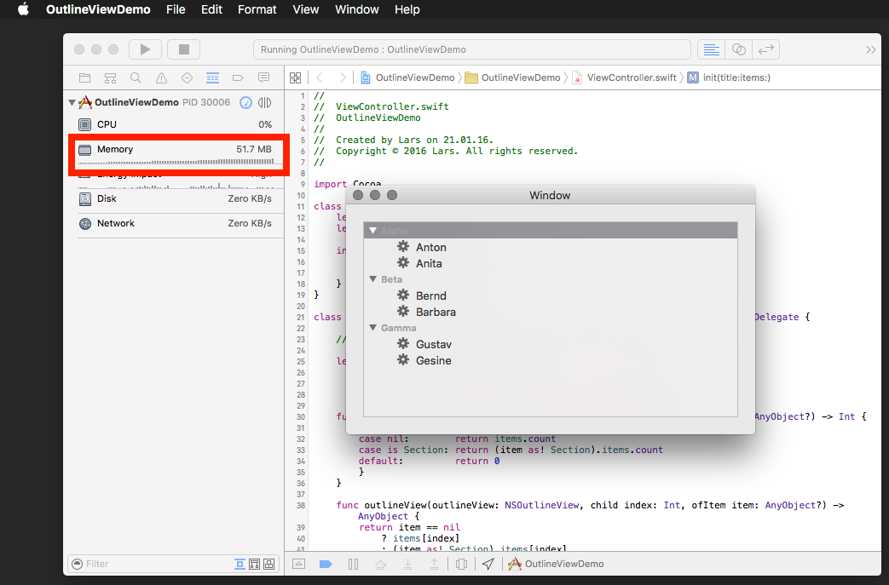

# nsoutlineview-memory-leak
Simple OSX app that reveals memory leaks in NSOutlineView.

1. Open the project in Xcode
2. Run it and select different items in the outline view by clicking them or using arrow up/down keys
3. Observe how memory is increasing constantly

